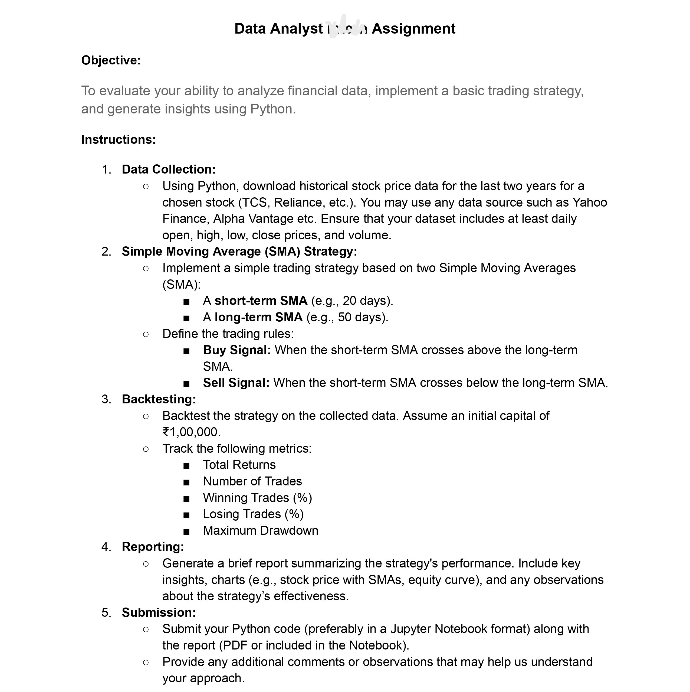

# TCS STOCK ANALYSIS  
## This  contains a Problem statement regarding last 2 years of TCS.NS Stock analysis using Python/Jupyter Notebook.  
:heavy_check_mark: All files are provided .   

### THIS Branch has Indivisual test case scenarios for Data Analysis which further contains:  
> Problem statement  
> Solutions & images  
> Observation reports  
> Readme.md  

## Problem Statement:

